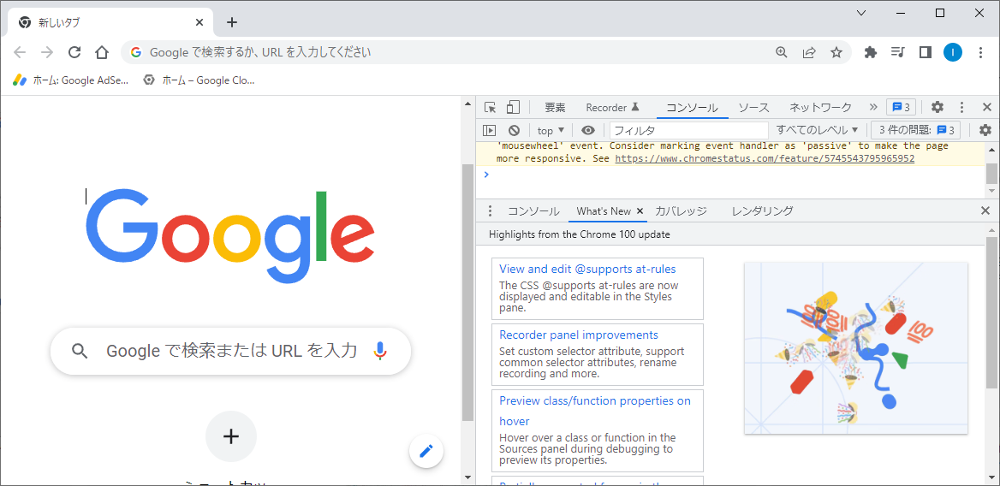

環境の準備
=

せっかくプログラミングを覚えようと思っても、最初の環境準備で躓くことが多いです。
なのでなるべく環境を準備させたくないのですが、「Google Chrome」「Visual Studio Code」「Git」の3つだけインストールをお願いします。
この後の解説では、これらのいずれかを利用してプログラムとは何かを解説します。

Google Chrome
-

Androidのスマホをもっている人にはおなじみのブラウザ[^ブラウザ]です。
本ドキュメントのプログラムはなるべくブラウザで確認できるものにしたいと思います。

インストールについては解説しませんので、周りの人に聞きながらインストールしてください。
インストール後、「デベロッパーツール」が表示できることを確認しておいてください。
（`F12`を押せば表示できます）

Visual Studio Code
-

Visual Studio Codeは使いやすいコードエディタ[^コードエディタ]です。
略して「VSCode」と呼んだりもします。
本ドキュメントのプログラムはVSCodeを使って書いていきます。

ChromeがインストールができたのであればVSCodeのインストールも難しくないと思います。
（解説しません）

VSCodeインストール後、「フォルダをVSCodeで開く」「ターミナル（bash）を開く（**！**）」の2つができることを確認しておいてください。

**！** 次項のGit（Git Bash）がインストールされていないとできません。

Git
-

本ドキュメントでは主にGitに同梱されているGit Bashのみ使用しますが、Gitもエンジニアの必須ツールですので、入れてしまいましょう。
現時点でGitもGit Bashも理解が難しいかもしれないので解説しません！

Gitのインストールはちょっと（かなり？）難しいと感じるかもしれません。
インターネットで調べたり、周りの人に聞きながら頑張ってインストールしてください。

[^ブラウザ]:インターネットを閲覧するためのアプリケーション
[^コードエディタ]:プログラムのコードを作成するのに特化したエディタ（アプリケーション）
