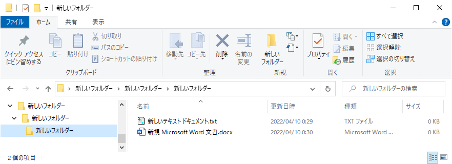

ファイルとフォルダ
=

プログラミングを知るためには、PCの仕組みを避けて通ることが出来ません。
最低限これだけは知っておいて欲しい**ファイル**と**フォルダ**について解説します。

要はコレ
-

Windows標準のファイラー[^ファイラー]エクスプローラでフォルダを開いて、中に入ってるファイルを参照している状態です。
このファイルとフォルダって何？というのを簡単に説明します。

ファイル
-

ファイルとはプログラムやデータの最小単位です。
実行可能なファイルをプログラムと呼びます。
プログラムのように実行できず、人間が取り扱うための **意味** を記述したもの、プログラムが取り扱うための**値**を記述したものをデータと呼びます。

ファイルにはテキスト形式とバイナリ形式があります。
テキスト形式は人間にも（一応）読める形で記述されていますが、バイナリ形式はコンピュータが読むことしか考慮されていません。
本ドキュメントではテキスト形式のプログラムを記述しながら学んで行こうと思います。

|      ＼      |テキスト    |バイナリ|
|--------------|------------|--------|
|**データ**    |ちょっと扱う|扱わない|
|**プログラム**|主に扱う    |扱わない|

余談ですがバイナリ形式のデータは年々、使われなくなってきています。

フォルダ
-

フォルダはファイルを分かりやすく整理するための論理的な入れ物で、主に人間のための視覚的なまとまりを表現するもの、と言えばよいかな。
フォルダの中にはファイルとフォルダを入れることが出来、入れ子の構造に出来ますので、これを利用して上手にファイルを整理しましょう。
と言いつつ、本ドキュメントではこれ以上フォルダについては掘り下げません。

ちなみにOSによってはフォルダではなく「ディレクトリ」と呼ぶこともあります。

[^ファイラー]:PC内のファイルを閲覧、操作するアプリケーション（ファイルマネージャとも言う）