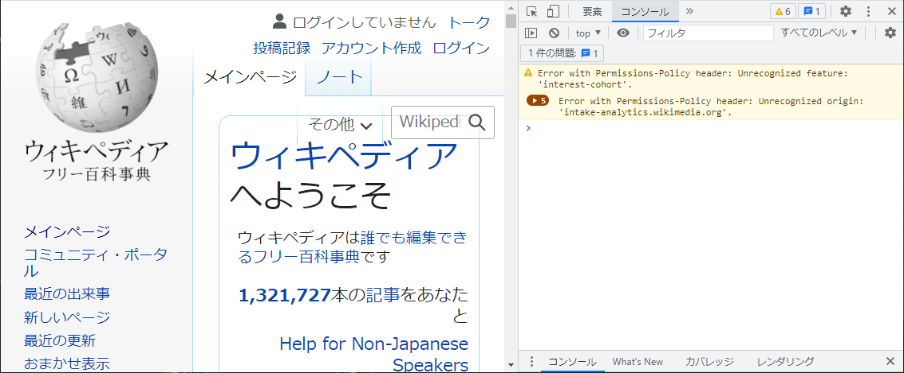
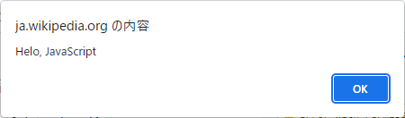
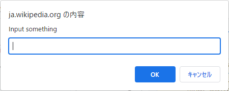
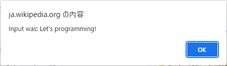
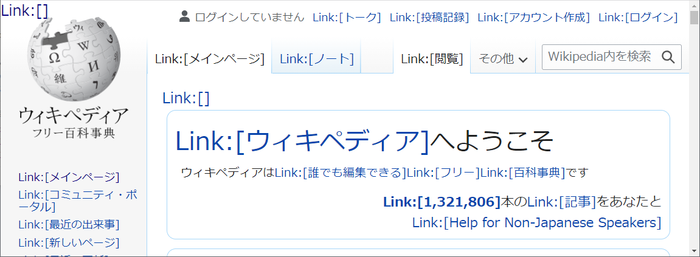

ブラウザとJavaScript
=

JavaScriptはブラウザに搭載されたスクリプト言語[^スクリプト言語]です。
インターネットの爆発的な普及という時代の荒波に揉まれましたが、生来の素姓の良さが幸いして今だオンリーワンの地位を維持する言語です。

準備
-

今回はChormeのデベロッパーツールを利用します。
1. Google Chromeを起動してください
2. ウィキペディアのメインページを開いてください
    （https://ja.wikipedia.org/）
3. `F12`キーでデベロッパーツールを開いてください
4. 「コンソール」タブを開いてください




とりあえず動かしてみる
-

コンソールは対話的なJavaScript実行環境です。
ここでJavaScriptを試してみましょう。

以下のJSコードをコンソールにコピペし、`Enter`キーを推してください。

```js
alert("Helo, JavaScript");
```
なんと1行でブラウザのGUIプログラミングが書けました。



次はこちらのJSコードを試してみましょう。

```js
if(input_text = prompt("Input something")){
    alert(`Input was: ${input_text}`);
}
```

今度は入力した内容を応答します。
（何も入力しなければ応答もしません）





HTMLとDOMについて
-

> JavaScriptはブラウザに搭載されたスクリプト言語です。

ブラウザはインターネット上のHTMLファイルを見るためのアプリケーションです。
HTMLファイルはDOM（Document Object Model）のツリー構造で表現されたデータ構造です。

```html
<html>
    <head>
        <!-- children -->
    </head>
    <body>
        <!-- children -->
    </body>
</html>
```

DOMツリーはデータ構造であり、HTMLも静的な（動きのない）ドキュメントです。
これに動きを加えるためにJavaScriptを使います。

JavaScriptからDOMを検索して、特定の要素に変更を加える一連の処理は、結構覚えることが多いので、ここでは扱いきれません。
簡単なサンプルと、その中で知るべき（学ぶべき）キーワードだけ、ご紹介しておきます。

```js
$x('//a').forEach(e=>e.text=`Link:[${e.text}]`);
```


- ```$x('//a')```：`xpath`を使ってHTMLの`a`タグ全てを取得する
- ```forEach()```：全ての結果（リスト）に対して処理を実行する
- ```e.text=`Link:[${e.text}]` ```：当該要素（`Element`オブジェクト）のテキストノードを書き換える

### 余談：DOM操作の最近

上記のサンプルスクリプトは、直接DOMオブジェクトにアクセスしていますが、今どきはこんな書き方をすることはまずありません。
`jQuery`というDOM操作を簡単にするライブラリがあり、一時期は盛んに使われていましたが、`jQuery`も今は古い技術になってきています。

現在は`React`や`Vue`といった、フロントエンドフレームワークを利用して、DOM操作そのものを行なわなくなって来ています。


スクリプト言語と実行環境
-

> JavaScriptはブラウザに搭載されたスクリプト言語です。

ブラウザ上でプログラミング言語が動く、ということがピンと来ないかもしれないので補足します。

どんなプログミング言語も、プログラムで出来ています。
スクリプト言語のコードを解釈して実行するプログラムのことを「実行エンジン」と呼んだりしますが、この実行エンジンも誰かに呼び出されて動きます。
ブラウザにもJavaScript実行エンジンが搭載されているため、ブラウザ上でプログラムを実行することが出来ます。

このJavaScript実行エンジンだけを取り出し、ブラウザ上ではなくPC（サーバ）上で実行できるようにしたのが`Node.js`です。


初期の`Node.js`は混沌としていましたが、`React`・`TypeScript`を中心とした一連のツールが出そろってきた頃から`Node.js`全盛期、`Node.js`一強時代と言える状況です。

このあたりの話は簡単には語りつくせない、深掘りするとキリがないので、これ以上は触れません。


[^スクリプト言語]:特定の環境下で動作する簡易的なプログラミング言語の総称（厳密な用語ではない）
