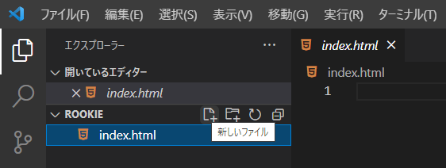
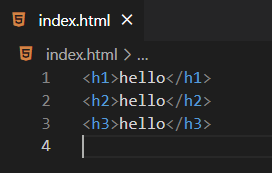
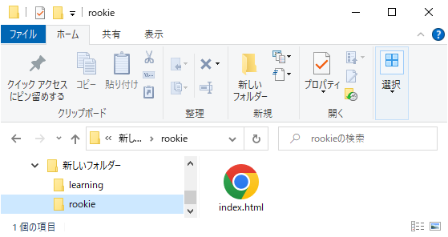
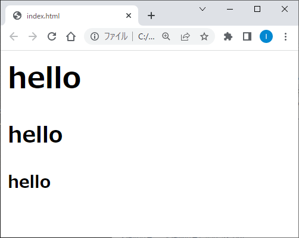

拡張子とマークアップ言語
=

ファイル名の末尾に付与する「拡張子」というものがあります。
これを題材に、PCがファイルを認識する仕組みを解説します。
プログラムとまでは言わないけれど、昨今のWeb全盛時代には避けて通れないHTMLについても軽く触れます。

準備：VSCodeでフォルダを開く
-

適当な名前でフォルダを作成し、VSCodeで開きましょう。
（画面例では`rookie`としています）

実技
-

### ファイルの作成

VSCode上でファイルを作成しましょう。
画面右側にあるファイル作成アイコンをクリックすると、新規ファイルが作成できます。
ファイル名が求められますので、`index.html`と入力します。



まだ中身が空っぽなので、以下の文字を入力してください。
（コピペでよいです）
```
<h1>hello</h1>
<h2>hello</h2>
<h3>hello</h3>
```

入力し終わったら、忘れずに保存しましょう。
保存は`Ctrl + S`キーを押すか、「ファイル→保存」から行ないます。

**なぜか** 一部の文字の色が違いますが、一旦気にせず進みます。



### エクスプローラで確認



ここで`rookie`フォルダをエクスプローラで見てみると、作成したファイルが**なぜか** Chromeのアイコンで表示されています。
一旦気にせず`index.html`をダブルクリックすると…ブラウザで表示されます。



### 何が起きたのか

ファイル名の最後の「.」以降の文字を**拡張子**と言います。
拡張子が`.html`のファイルは、**HTMLファイル**と言います。

なお、`index.html`をダブルクリックするとブラウザが開きましたが、これはOSの機能です。
OSの設定でHTMLファイルがブラウザと関連付けされているため、ダブルクリックするとデフォルトのアプリケーション（＝ブラウザ）で開いた、という訳です。

ブラウザはインターネット上のHTMLファイルを閲覧するためのアプリケーションであり、（今作った）手元のHTMLファイルも表示できます。

### HTML言語について

HTMLはいわゆるマークアップ言語と呼ばれるものです。
マークアップ言語とは特定のアプリケーションで解釈・処理するためのデータ構造、記述ルールと言えます。
HTMLの場合、ブラウザで表示するためのデータ記述ルール、ですね。

難しいものではないので、以下のサイトや書籍などで学ぶとよいでしょう。
- [HTML 入門 - ウェブ開発を学ぶ - MDN Web Docs](https://developer.mozilla.org/ja/docs/Learn/HTML/Introduction_to_HTML)

### 余談：JavaScript

> ブラウザはインターネット上のHTMLファイル（など）を閲覧するためのアプリケーションであり、（今作った）手元のHTMLファイルも表示できます。

HTMLと言えばWebシステム、Webシステムと言えばJavaScriptです。
昨今、JavaScriptがメチャクチャ流行っていますが、元は（今も）ブラウザ上で動くスクリプト言語です。
そんなJavaScriptを学ぶ際にも、HTMLの基本は知っておいた方が良いです。