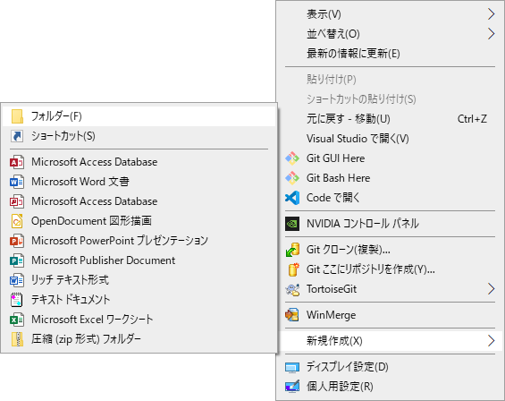
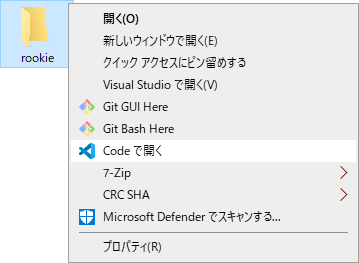
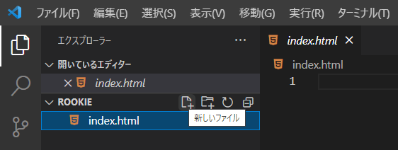
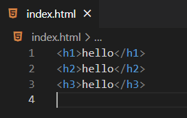
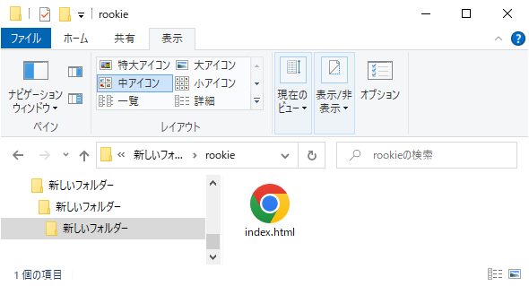
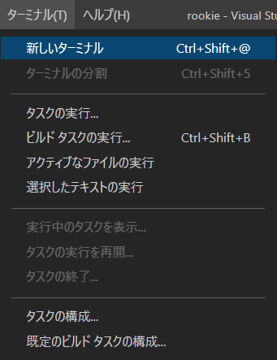

VSCodeでデータファイルを作る
=

作業用フォルダをVSCodeで開く
-

まずは本ドキュメント用のフォルダを作成します。
デスクトップを右クリックして「新規作成→フォルダ」を選ぶとフォルダが作成できます。



フォルダ名は半角であれば何でも良いのですが、本ドキュメントでは`rookie`として話を進めます。

フォルダが作成出来たら、これを右クリックしてVSCodeで開きます。
この操作は作業開始前に毎回行うことになるので、覚えておいてください。




HTMLファイルの作成
-

VSCodeが立ち上がったらファイルを作成しましょう。
画面右側にあるアイコンをクリックするとファイルが作成できます。
ファイル名が求められますので、`index.html`と入力します。



まだ中身が空っぽなので、以下の文字を入力してください。
（コピペでよいです）
```
<h1>hello</h1>
<h2>hello</h2>
<h3>hello</h3>
```

入力し終わったら、忘れずに保存しましょう。
保存は`Ctrl + S`キーを押すか、「ファイル→保存」から行ないます。




ここで`rookie`フォルダをエクスプローラで見てみると、




---
コマンドラインからファイルを作成しますので、ターミナル（Git Bash）を立ち上げます。


