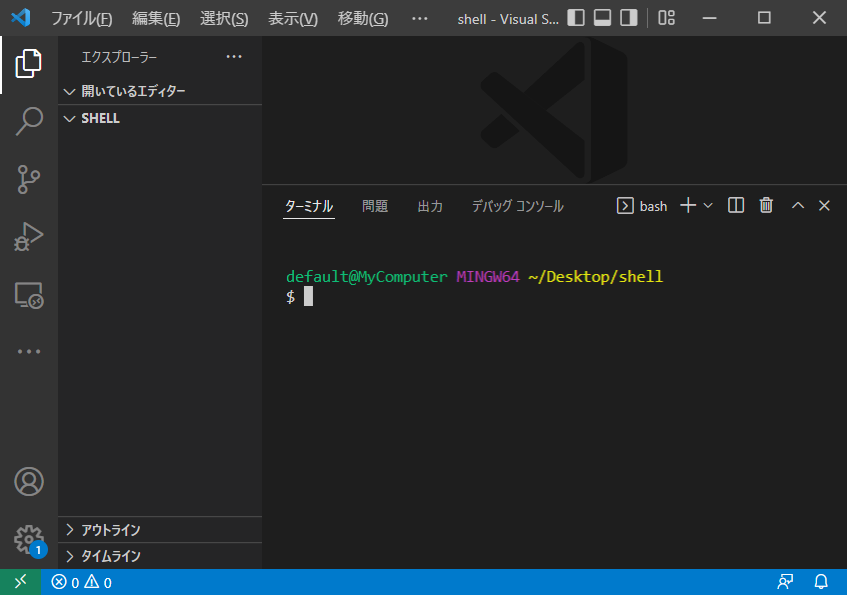

コマンドとシェルスクリプト
=

映画のワンシーンで、天才ハッカーがタッターンとキーボードを叩くシーンがありますね。
あれっぽい雰囲気のあるCUI（キャラクタユーザインターフェース）画面を体験しましょう。
ここでは`bash`というシェルスクリプトを使います。


準備：VSCodeでフォルダを開く
-

適当な名前でフォルダを作成し、VSCodeで開きましょう。
（画面例では`shell`としています）

ターミナルでbashを開いてください。
今回はここを使っていきます。



 ←こうなっていればOKです。


基本的なコマンドを叩いてみる
-

### echo

ターミナルに`echo hello`と打ってみましょう。
```sh
$ echo hello
hello
```
打ったコマンドの下に"echo"と表示されました。

`echo`コマンドは画面表示するコマンドです。
コマンドと呼びましたが、`echo`もプログラムです。
（何に使うのかピンと来ないほど）シンプルな機能しか持たないプログラムのことをコマンドと呼んだりします。

- 変数の値を表示する
    ```sh
    $ echo ${SHELL}
    /usr/bin/bash.exe
    ```
- サブコマンドの結果を表示する
    ```sh
    $ echo $(date)
    2022年 4月 14日 木曜日 00:49:28
    ```
    ```sh
    $ echo $((1 + 2 + 3))
    6
    ```

何となく分かってきましたか？
`echo`は固定の文字だけでなく、色々な値や結果を**人間に見えるように**表示するコマンドです。

では次はどうでしょうか？

- 結果のリダイレクト
    ```sh
    $ echo ${RANDOM} >> result.txt
    $ echo ${RANDOM} >> result.txt
    $ echo ${RANDOM} >> result.txt
    ```

何も表示されませんね。。
でもテキストファイルが作成されていることに気付きましたか？
（`${RANDOM}`は呼ぶたびに乱数を返す特殊なシェル変数なので、表示される内容（数字）は画面例とは異なっていると思います）


リダイレクトは、画面に出力されるはずの結果を別の場所（今回は`result.txt`というファイル）に転送します。


### cat

ターミナルに`cat`と打ってみましょう。
```sh
$ cat result.txt
28301
6309
14163
```
先ほど作成されたファイルの中身が表示されました。
`cat`コマンドはファイルの中身を出力するコマンドです。

`cat`コマンドにリダイレクトを組み合わせると、ファイルのコピーと同等の動作が行なえます。

```sh
$ cat result.txt > copied.txt
```
結果は何も出力されず、新たに`copied.txt`というファイルが作成されています。

### パイプによる組み合わせ

コマンドは組み合わせることで威力を発揮します。
パイプという仕組みで実現します。

`cat`は複数のファイルを指定することが出来、指定されたファイルの内容を順番に出力します。

```sh
$ cat result.txt copied.txt
28301
6309
14163
28301
6309
14163
```

この出力をパイプ（`|`）で別のコマンドに流します。

```sh
$ cat result.txt copied.txt | sort
14163
14163
28301
28301
6309
6309
```

`sort`コマンドが`cat`の出力を並べ替えました。
…が、並び順に違和感がありませんか？
`sort`コマンドはデフォルトで文字列として比較します。
なので、先頭文字が小さいものから前に並びました。

`-n`オプションで数値として並べることもできます。
```sh
$ cat result.txt copied.txt | sort -n
6309
6309
14163
14163
28301
28301
```

さらに`uniq`コマンドで重複を排除してみましょう。

```sh
$ cat result.txt copied.txt | sort -n | uniq
6309
14163
28301
```

パイプ（`|`）はあるコマンドの出力を、次のコマンドの入力として流し込む仕組みです。
これを利用することで、コマンドを組み合わせた複雑な処理を作ることもできます。


さらなる使い道
-

### 自分コマンド

これらコマンドを記述したファイルに記述すると、実行可能なファイル（＝自分コマンド）が作成できます。

```sh
#!/bin/bash

# Set target directory
SEARCH_DIR=/path/to/search/dir
REMOVE_DIR=/path/to/remove/dir

# Removing files older than 14 days
cd ${REMOVE_DIR}
find . -mtime +14 -type f | xargs rm -f
cd -

# Moving files older than 7 days
cd ${SEARCH_DIR}
find . -mtime +7 -type f | xargs mv --target-directory=${REMOVE_DIR}
cd -
```
上記は一連の作業をコマンド化した例です。
以下の動作を行ないます。

* `REMOVE_DIR`フォルダの中で14日以上経過したファイルを削除する
* `SEARCH_DIR`フォルダの中で7日以上経過したファイルを`REMOVE_DIR`に移動する

これを毎日自動実行すれば、小さな雑用を無くすことができますね。
（こういうのをバッチ処理、と呼んだりします）


### 組み合わせ

自分コマンドも、既存のコマンドと同様に、パイプで組み合わせて使うこともできます。
他のコマンドと組み合わせるためには、入力と出力をちゃんと考えなくてはいけないので、今回は取り扱いません。

シンプルなのに奥深いシェルスクリプトの世界。
さわりだけの紹介でしたが、現代コンピュータの本質に迫る普遍的な仕組みであり、日常業務の自動化にも有効です。

